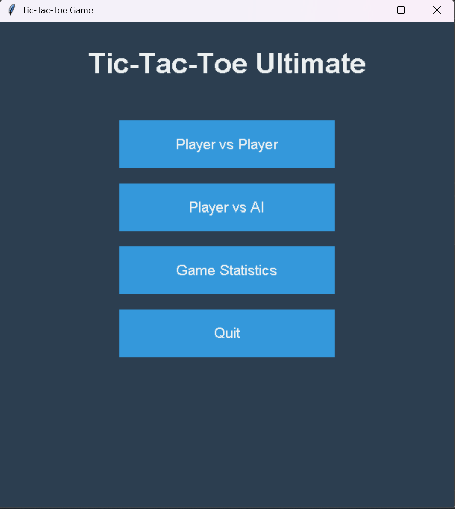

Here is a **perfect README.md** you can put in your GitHub repository for your Tic-Tac-Toe Ultimate project.
It is clean, professional, and easy to understand — like real GitHub projects 👇

---

# 🎮 Tic-Tac-Toe Ultimate

A modern, feature-rich, and beautifully designed Tic-Tac-Toe game built with **Python**, **Tkinter**, and **AI (Minimax)**.

---

## 🚀 Features

### ✔ **Multiple Game Modes**

* **Player vs Player (PVP)**
* **Player vs AI** with 4 difficulty levels:

  * Easy (random)
  * Medium (semi-smart)
  * Hard (strategic)
  * Unbeatable (Minimax algorithm)

---

## 🧠 Artificial Intelligence

The AI uses different logic depending on chosen difficulty:

* **Easy** → random moves
* **Medium** → 70% chance to block/win
* **Hard** → always blocks or wins if possible
* **Unbeatable** → Minimax algorithm (perfect play, impossible to beat)

---

## 🕹️ Gameplay Features

* Beautiful animated GUI using Tkinter
* Player turn indicator
* 30-second timer per move
* Auto timeout handling
* Win/draw detection
* Highlighting of the winning line
* Live score tracking

---

## 📊 Game Statistics

Automatically saves lifetime stats to `tictactoe_stats.json`:

* PVP wins
* PVP draws
* AI wins
* AI draws
* Total games played

---

## 💾 Save & Load System

You can save and load any match using:

* **Save Game** button
* **Load Game** button

Saves include:

* Full board state
* Player turn
* AI difficulty
* Timer state
* Scores
* Winning line

Stored in `tictactoe_save.json`.

---

## 🎨 Interface

* Modern blue UI
* Red "X", green "O"
* Yellow highlight for winning moves
* Responsive layout with headers, timers, menus

---

## 📁 Project Structure

```
/project
   ├── main.py
   ├── tictactoe_stats.json
   ├── tictactoe_save.json
   ├── assets/ (optional: sounds, icons, etc.)
   └── README.md
```

---

## ▶ How to Run

### **1. Install Python 3**

Make sure Python 3.8+ is installed.

### **2. Install dependencies**

```bash
pip install pygame
```

(Tkinter is included by default in Python.)

### **3. Run the game**

```bash
python main.py
```https://github.com/echoenvoy/Tic-Tac-Toe-Game/blob/main/README.md

---

## 🛠 Technologies Used

* **Python**
* **Tkinter (GUI)**
* **Pygame Mixer (Sound effects)**
* **JSON (Data storage)**
* **Minimax Algorithm (AI)**



---

## 📷 Screenshots 


```


[Screenshot](screenshots/a2.png)
```

---

