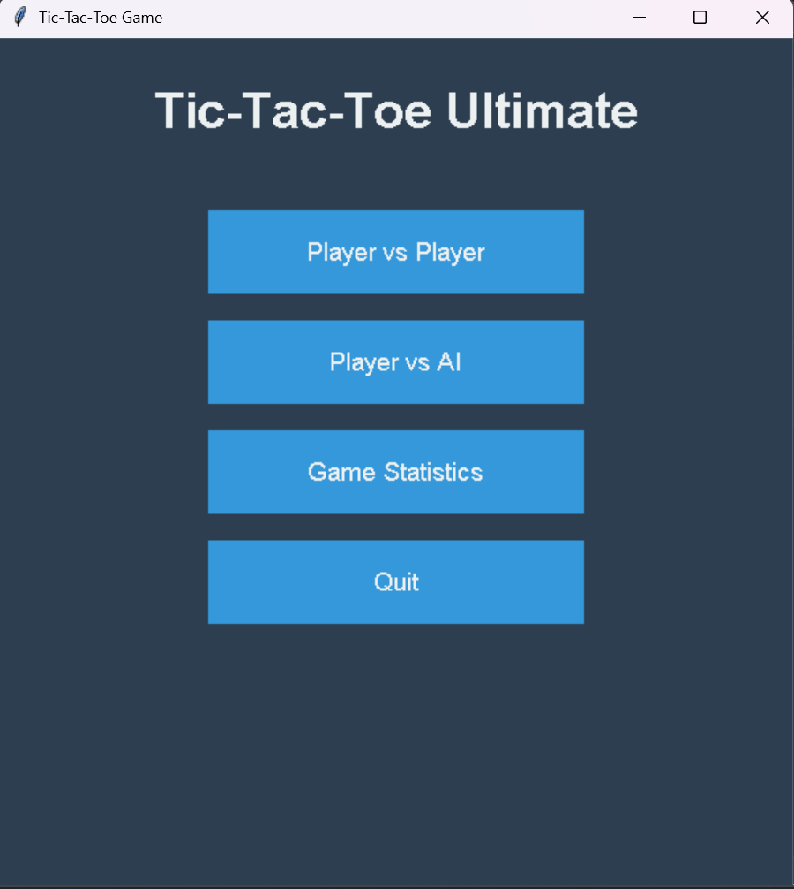
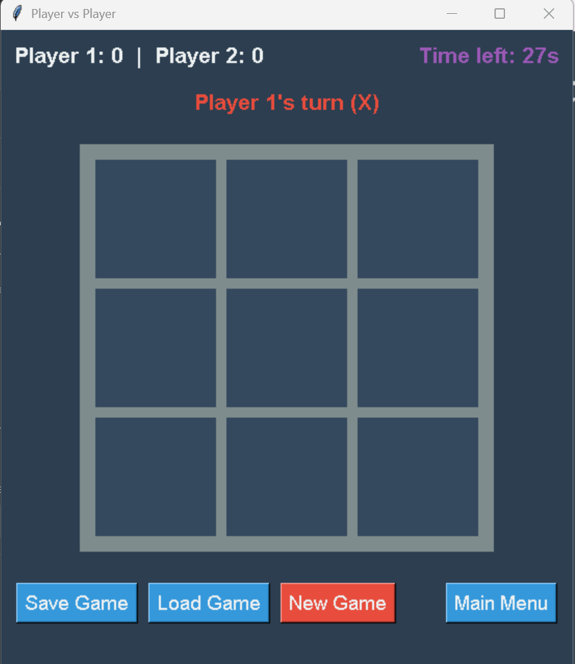
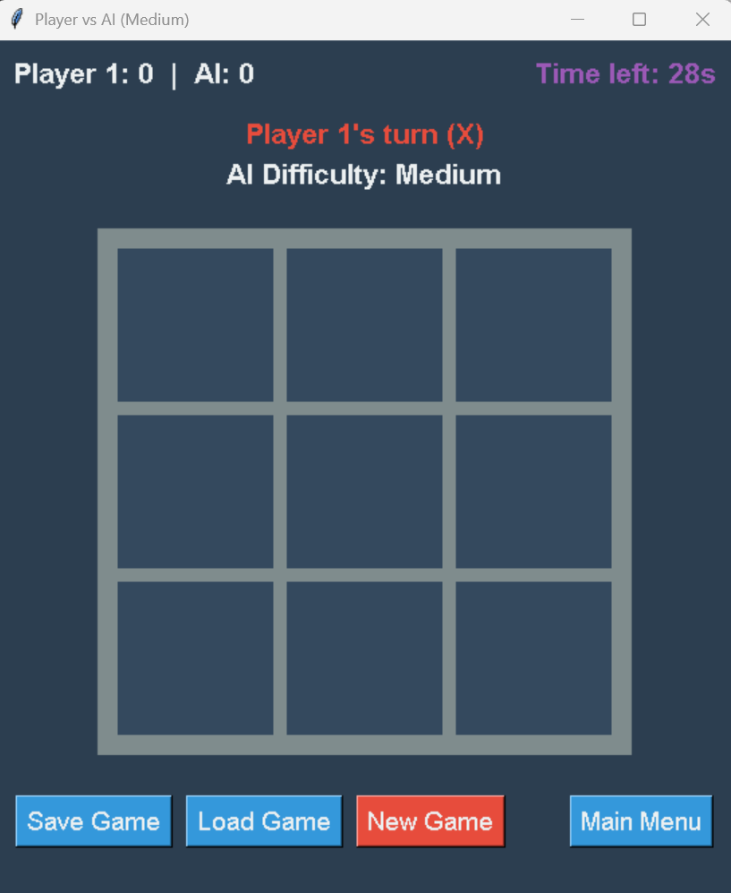
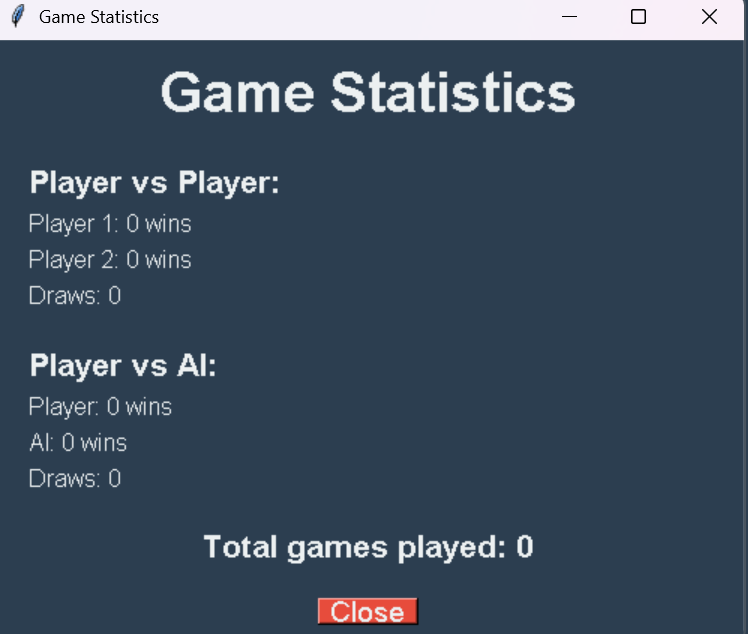

# Tic-Tac-Toe Ultimate

A feature-rich desktop Tic-Tac-Toe game built with Python and Tkinter, featuring multiple AI difficulty levels including an unbeatable Minimax implementation. Built using a vibe coding approach, combining AI-assisted coding with manual design, debugging, and optimization.

---

## Overview

Tic-Tac-Toe Ultimate offers:

* Player vs Player mode
* Player vs AI mode with four difficulty levels
* Smart AI logic including Minimax (unbeatable mode)
* 30-second move timer with auto-timeout
* Win/draw detection with highlighted winning line
* Live score tracking
* Save and load functionality
* Persistent lifetime statistics

---

## AI System

* Easy – random moves
* Medium – partially strategic (block/win logic)
* Hard – always blocks or wins when possible
* Unbeatable – Minimax algorithm with optimal play

---

## Technical Highlights

* GUI built with Tkinter
* Sound effects using Pygame Mixer
* JSON-based persistent storage for stats and saves
* Modular game logic with clear state management
* Implementation of the Minimax algorithm for perfect AI

---

## Technologies Used

* Python
* Tkinter
* Pygame
* JSON

---

## Run Locally

```bash
pip install pygame
python main.py
```

Requires Python 3.8+.

---

## Demo

Gameplay video:
[https://drive.google.com/file/d/1ZKCN-5LujRKRgnZEz7OsIXBtuPZQbljo/view?usp=sharing](https://drive.google.com/file/d/1ZKCN-5LujRKRgnZEz7OsIXBtuPZQbljo/view?usp=sharing)

---

## 📷 Screenshots 
<p>
  
  
</p>
<p>
  
  
</p>

This project demonstrates GUI development, AI implementation, algorithmic thinking, and structured state management in Python.

---

